---
title: Classical CV Approach
layout: template
filename: classical-cv.html
--- 

## Previous Work

Two of our collegues performed some initial work on a CenterNet-based ML detection approach. They
had some success with this approach on the data available to them. We used their results as a
baseline. One of the major challenges with using ML to solve this detection problem is a lack of a
diverse dataset. We only have labeled footage from two videos, so any model we train would be
extremely overfit to the data that we do have labeled. While one approach would be to find and label
more data, this approach is challenging since the amount of first person footage of the rune game
that we have access to is limited.

Other teams have been relatively successful in this detection problem; however, their work is not
open source and these teams are from China, so there is no line of discourse to discuss this problem
with them. This project will provide a basis for evaluating potential solutions to the rune game
problem. In particular, we wanted to see how ML approaches compared to non-ML ones.

When approaching this problem from a classical CV perspective, we used a paper called "Detection and
Classification of Geometric Shape Objects for Industrial Applications"
[[1]](https://www.researchgate.net/publication/330999380_Detection_and_Classification_of_Geometric_Shape_Objects_for_Industrial_Applications)
as a reference for our initial classification pipeline. This paper describes a binarization and
object identification technique. Once individual objects have been detected, the paper then fed
identified binary images of particular objects into an ANN or SVM to classify the type of image.
While we decided to opt for a classify binary images using a non-ML approach, we believe future
research could be done into applying something like an SVM to classify individual parts of the rune
game after binarization and object detection is performed (see the [next steps](#next-steps)
section).

## Approach

We approached the rune game problem using a variety of classical computer vision techniques.
Approaching it using these techniques is particularly enticing due to the structured nature of the
detection problem. The feature space is highly contrained, and the detector doesn't have to
generalize well--it must only detect particular features from the rune game when the camera is
situated at a particular position 8 meters from the rune game. There are many "knowns" about the
features we are detecting. The geometry of the rune game is known and the maximum camera skew from
the center of the rune game is also a known. Thus, we can semantically encode all of the known
information about the rune game into the detector and have it pretty reasonably identify all the
features we care about in the rune game. With a classical CV approach, there is the issue of
manually overfitting the geometry contraints of particular features to the data the system is tested
on; however, because the number constants are known, not numerous (compared to ML weights), and well
understood, we can quickly tune the detector to work at the competition venue.

The detector was written in C++ using OpenCV2. Because the detector has to run at at least 60 fps to
meet the real-time demands of the system, using C++ was a necessity, espically given the large
amount of image procsesing and function calls, which if written in Python would cause the system to
run much slower.

### Jargon (Feature Label Names)

Before getting into the nitty-gritty of how classification was performed, it is useful to understand
some terms we used to describe features of the rune game. Refer to the image below for names and
labels.

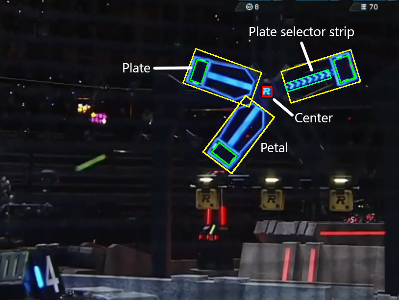

Note the following:

* The petal includes the plate selector strip and the plate.
* The plate is location that you are trying to hit as the rune game turns.
* The plate selector strip is used to identify which plate should be hit next.
* The center is necessary to detect to perform ballistics so we can "lead" the plate when aiming at
  it.

### First Attempt

We first tried a very simple approach object detection approach to the problem. The main source code
for this attempt can be viewed
[here](https://gitlab.cs.washington.edu/mma35/cse-455-classical-cv/-/blob/rune-game-old/src/rune_game/rune_game_detector.cpp).
This included the following:

Preprocessing the color and grayscale components of the image, using thresholding to find important
edge features in the grayscale image and to find the portions that matched the proper color in the
color image. The resulting grayscale and color thresholding on an example frame can be seen below.

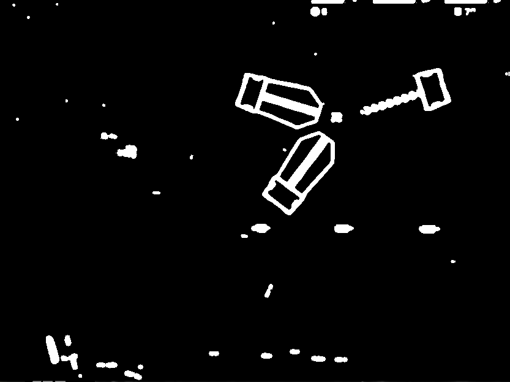 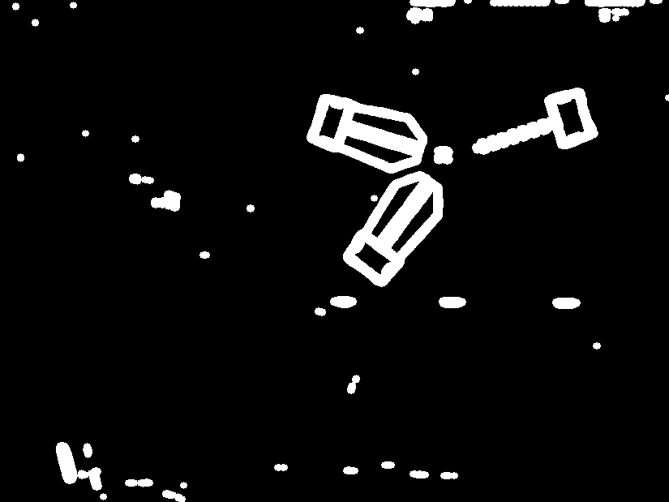

These thresholded images were combined together to create an image that contained features with
meaningful edges and performed contour detection on this image. Using our understanding about the
structure of the features of the rune game we can then determine which portions of the image are the
petals and which are the plates of the rune game from purely the heirarchy of the contour map.
Bounding boxes can be drawn around potential petals and the best petal can be selected based on a
combination of our understanding of the contour heirarchy and the portion of the bounding box that
is colored. While this worked reasonably well in some senerios, this approach led to many missed
detections since image noise and other factors can cause the detector to ignore petals that it
should have detected. An example of a missed detection is shown below, where a small edge inside the
petal threw off the detection of the petal and caused the detector to ignore the correct petal.

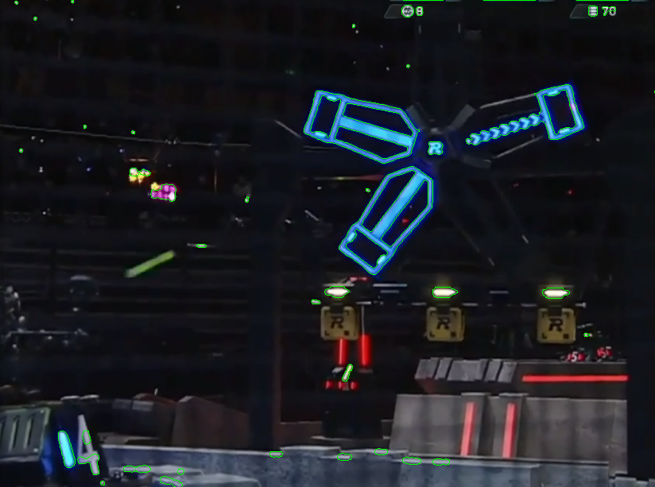 

If the correct petal and plate _were_ detected correctly, we could pretty reasonably compute where
the center of the rune game was using the known gemoetry of the petal and the plate inside it. An
example of a successful detection with centerpoint extrapolation can be seen below.

However, since we were relying on the petal detection to tell us the location of the center, if the
detection was slightly skewed, this resulted in a centerpoint prediction that was off the center, as
can be seen below.

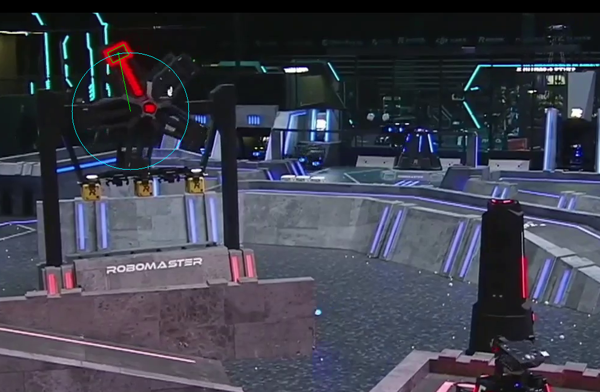

### Second Attempt

#### Armor Plates

To remedy the issues described above, a second pass was taken at the detector. This time the
detector became more complex. The source code for this can be seen
[here](https://github.com/MatthewMArnold/CSE-455-Final-Project/tree/master/src).

Instead of attempting to find entire petals using contour heirarchies, we next focused on detecting
individual components of the petal--the individual plate, the petals, the center of the rune game.

The image preprocessing done to produce a single channel image was done in a similar manner as was
done in the first approach.

To detect the rune game plates, we took advantage of the fact that the plate will not be at the top
level of a contour hierarchy because it will always be surrounded by a colored box. By removing the
external contours of an image, we can quickly narrow down potential plate candidates. Furthermore,
since we aren't conditioning upon the fact that the contour has no children, any plate with some
weird color blob in the center can still be detected.

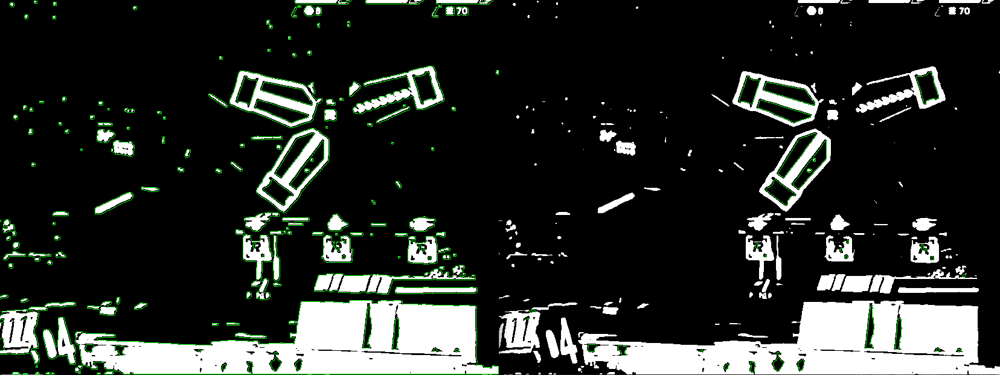

Next, each of the contours is evaluated for "plateness" to find the best plate. Some potential
plates are shown below:

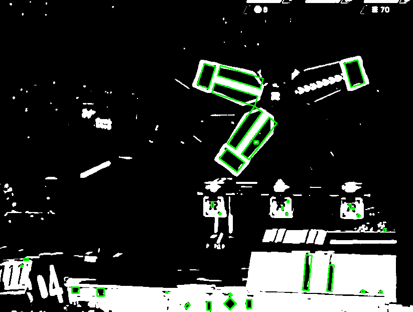

Finally, we eliminate obvious plates because we know the geometry of the plate, and we know that
when we are detecting the plate the rune game will be directly in front of us. Given some contour,
we check if the blob enclosed by the contuor is an armor plate by doing the following:

* The contour area must be within some min/max value.
* The contour height/width must be within some min/max value.
* The ratio between the height and width must be within some min/max value.
* The ratio between the contour area and the area of a bounding box that encircles the contour must
  be less than some value. This ratio is small if for example the contour is a "U" shape but large
  if the ratio is a square.

Similar geometry validation techniques as described above were used to classify other features of
the rune game as well. While having so many different parameters can lead to tuning challenges down
the road, all the parameters are extremely well understood and can be tuned rapidly. Furthermore, we
found that each individual constraint did not have to be extremely constraining since the many
constraints quickly filtered down improbable results. As a result of filtering out armor plates is
shown below.

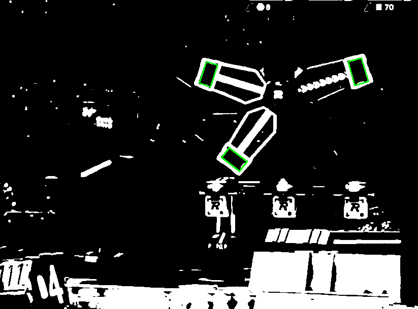

#### Rune Game Petals

Next, we detect the petals. By knowing where the petals are, we can more convincingly find the
target armor plate and the plate selector strip since these features must intersect a rune game
petal.

First, dialation/erosion filtering is done on the preprocessed grayscale image that was used for
armor plate detection. Next, the _external_ contours of the grayscale image are extracted from the
grayscaled thresholded image. An example external contour map is shown below.

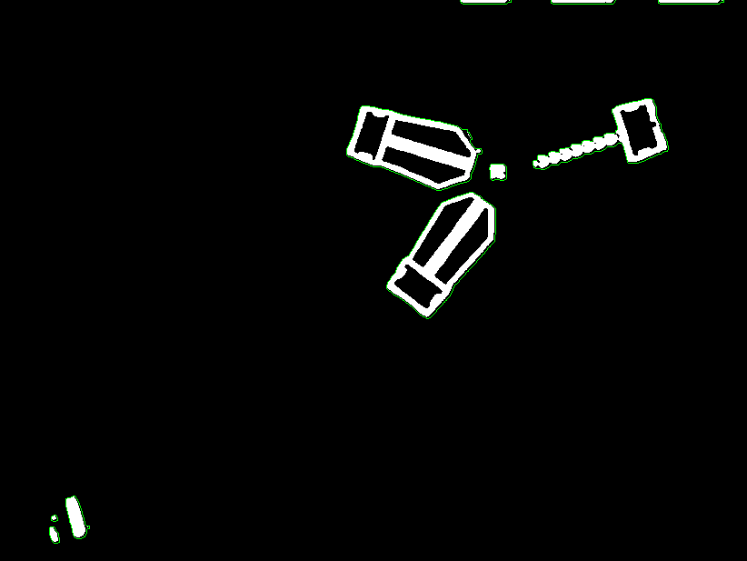

Removing all internal contours from the image removes a good deal of features that are not petals,
so after this we applied geometry thresholding similar to what is done when detecting the armor
plate. One important difference that we found between detecting armor plates and petals is that we
should not use the contour area as a metric for geometry thresholding but instead should use the
area of the rectangle that bounds the contour area. Consider the petal contours above. In this
image, the petal with the plate selector strip has a significantly smaller contour area comared to
the other two even though they are both petals.

Once the features that are not petals are removed, we are left with only bounding boxes around the
features we believe are petals, as can be seen below.

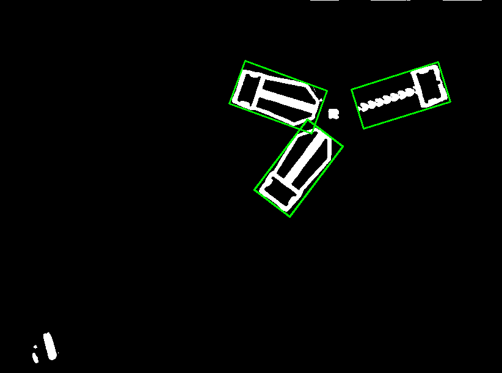

#### Plate Selector Strip

The plate selector strip is the feature that tells us which armor plate should be targeted next. We
know the geometry of this feature and we know that the selector strip is going to be in a
subsetction of one of the already identified petals.

The main difference between detecting the plate selector strip aside from its geometry is we somehow
have to differentiate the contours of the selector strip from the plate. Since we have already
detected the plates; however, we can remove the plates from the binarized image that we use to
detect contours. We chose to do this by drawing rectangles over the binarized image where we had
previously detected plates. This appeared to work well in tested senarios. An example of first
removing the detected plates and then running contour detection on this image is shown below.

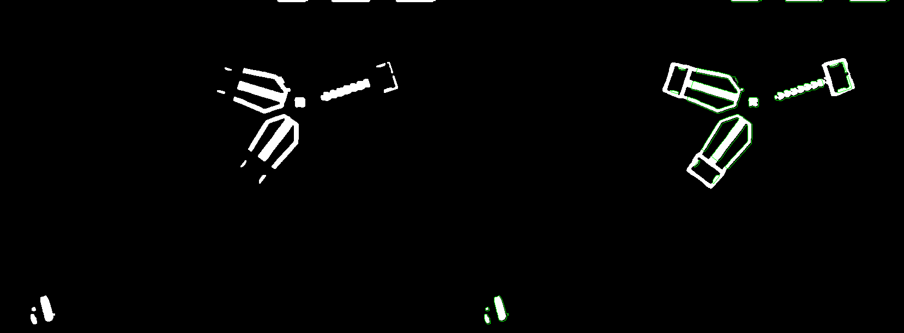

Finally, similar techniques were used to rule out invalid plate selector strips. In addition to
validating the geometry of each potential contour, we also check to ensure the bounding box
surrounding the potential plate selector strip intersects significantly with one of the bounding
boxes surrounding possible rune game petals. By performing this filtering on the image, the plate
selector strip can be seen as shown below.

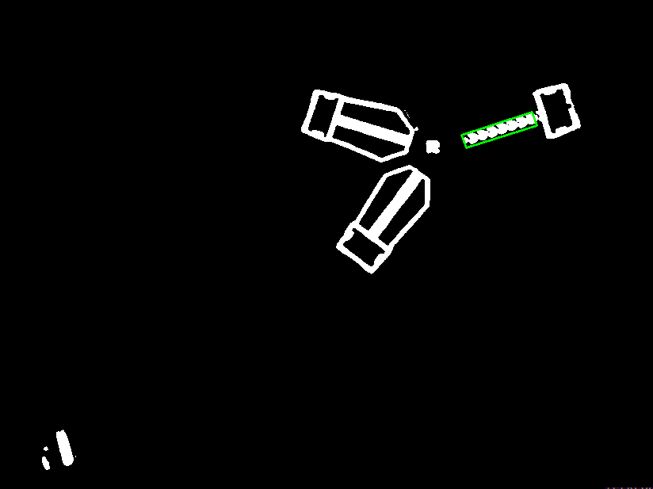

#### Rune Game Center

The center of the rune game is a small "R" located at the point of rotation of the rune game. Aside
from doing the typically geometry filtering that we did for other features, since it is guaranteed
that this feature is generally in the center of the ROI, we check to ensure possible centers are in
the center of the image using contour intersection techniques.

#### Putting it all together

We can combine all the feature detection algorithms to detect the entire rune game, as shown below.
All the features are detected. Since we detected the armor plate and plate selector petal, we can
group these because they intersect the same petal and thus can identify a single plate that should
be hit next (the one boxed in red in the image below).

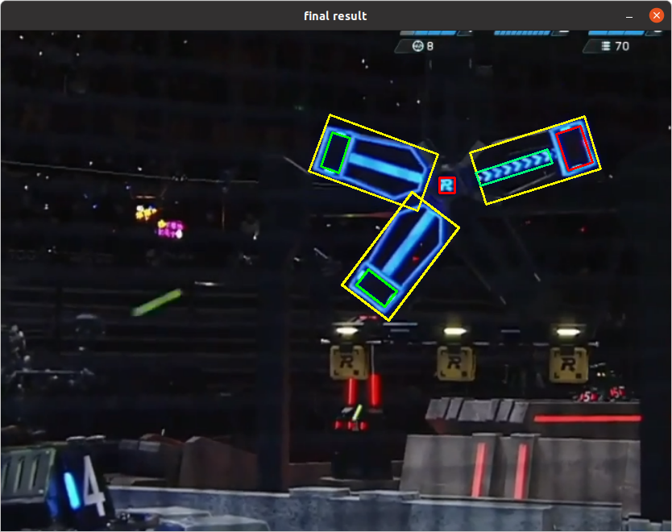

We can also run this algorithm on videos as well and qualitatively review the results:

More discussion on the quality of the results can be found on the [home page](index.html).

## Datasets

For the classical CV detector, we relied extensively on hand-picked video clips that display the
rune game in an almost first-person view that are accessible on
[twitch](https://www.twitch.tv/robomaster). A subset of the data used to hand-tune the classifiers
many parameters are available
[here](https://gitlab.cs.washington.edu/mma35/cse-455-final-project/-/tree/master/test-footage).

### Reflection/Comparing our Work

## Miscellaneous OpenCV-related Discussion

We chose to implement this project in C++ because of the speed it afforded compared to Python. One
of the pretty important features for us that we implemented, as in any C++ project, was pulling out
the metadata from the source code in a manner that allowed for faster debugging and iteration to
avoid the tedium of recompilation. There were a lot of parameters to tune, so being able to quickly
change constants was a must. Furthermore, we wanted to avoid writing a lot of C++ code to directly
interface with the data. We desired a workflow that only requires you to add some metadata file with
some constants and then be able to use these constants in your code without adding duplicate
constants in some settings file to get populated upon loading the stetings file. To avoid this, we
created a settings loader whose location was passed in when running the application. This loader
loaded all the metadata files listed in the master configuration file into a map of
`cv::FileStorage`'s, which allowed OpenCV's powerful `FileStorage` object to be leveraged to avoid
the issues described above while still maintaining the structure of multiple unique configuration
files.
